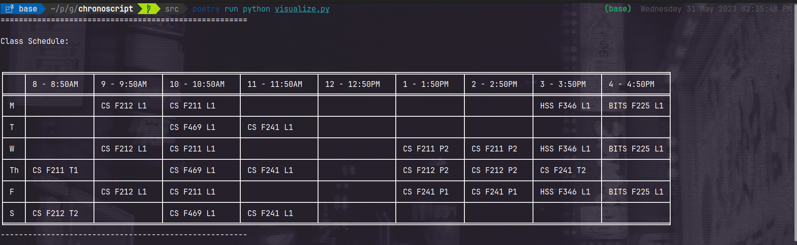
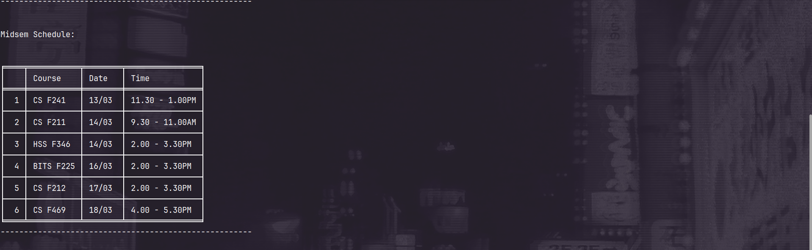
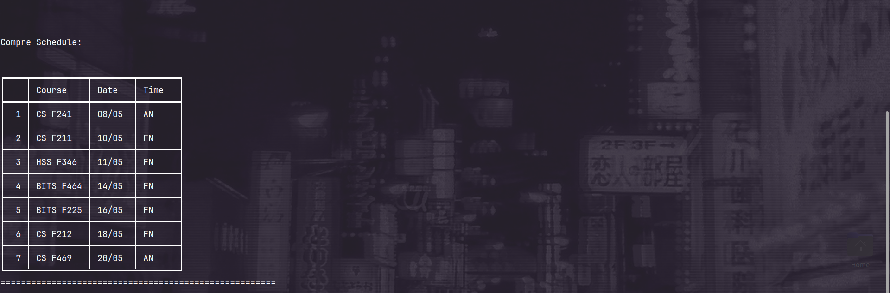
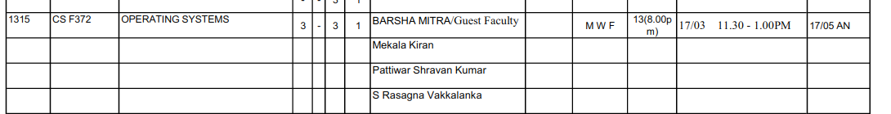
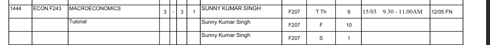

# Chronoscript

Chronofactorem exists, yes. It helps you make your timetable while checking for possible clashes, yes. But is it the timetable that matches your need the most? Maybe, you'd never know for sure.

Depending on the courses you want, and the CDCs you need to take, there can be thousands of possible timetables. Going through each of them is a .. not so fun task. Well, to an extent you can now automate this.

Chronoscript currently automates the process of:

1. Converting the timetable pdf to a csv file.
2. Converting the csv file to a json file. (used for the chronofactorem website and the timetables script).
3. Generating all possible timetables with the given set of courses (without class hours **or** exam timing clashes).
4. Filters them and sorts them based on your needs. (days you want free, or days you want _liter_ than others).

## Important information

1. This is **not** an official BITS project. We work with the timetable pdf that is made available to all students, and if there are any errors in details/formatting of the timetable, the tool may not work as expected. So, after the timetables are formed, it is advised to verify the timetable of your choice with the official timetable pdf (including exams).

2. The scripts generate multiple possible/permutations of the timetables which do not have any clashes, it is very compute heavy. This is why it is not going to be incorporated as part of the chronofactorem website as of now, and can only be run locally.

3. Additionally, it was not built with first-years in mind as your timetables will not have clashes and there are too many to take care of. However we will be working on optimising the code to make it work for first-years as well in the future.

## Contributing

1. We accept feature requests and bug reports as issues on this repository. If you want to contribute code, please open a pull request.

2. We appreciate any kind of help, be it code, documentation, or even just suggestions. If you want to contribute but don't know where to start, please reach out to any one of us.

## System requirements

1. Python `3.7+`, `3.10.11` is recommended. (Download from [here](https://www.python.org/downloads/), if you don't already have it installed)

2. Poetry (package manager for python) `1.5.0` is recommended. (Installation instructions for all platforms [here](https://python-poetry.org/docs/#installation))

3. The timetable pdf as given by the administration.

## Usage instructions

1. Clone this repository to your local machine (or) download the zip file and extract it.

2. `cd` to the src directory.

3. Run `poetry shell` to activate the virtual environment.

4. Run `poetry install` to install all the dependencies.

5. Open `converter.py` and navigate to the bottom of the file.

6. Modify the variables as the comments suggest to suit your needs/timetable. `(headers, file and page_range)`

7. Run `poetry run python converter.py` to generate the csv file.

8. Fix any errors in formatting or course details in the CSV file (see more below in the [Fixing errors in the CSV file](#fixing-errors-in-the-csv-file) section).

9. Open `create_json.py` and navigate to the bottom of the file.

10. In the general case, there shouldn't be any need to modify the variables. However, if there is a column reorder in the csv file, you can modify the `columns` variable to match the order of the columns in the csv file.

11. Run `poetry run python create_json.py` to generate the json file.

12. If there are any particular course sections you'd like to avoid, remove them from the json file generated.

**Note:** We are currently working on a feature that allows you to do this interactively, but for now you'll have to do it manually.

13. Open `timetables.py` and navigate to the bottom of the file.

14. Modify the `CDCs`, `DELs`, `OPELs` and `HUELs` variables with the course codes you definitely want in your timetable.

15. Modify the `free_days` variable with the days you want to have free if possible.

16. Modify the `lite_order` variable with the relative order of _liteness_ you want to have in your timetable. For example, if my order is

```python
["S", "M", "Su", "F", "T", "W", "Th"]
```

, then I want to have a timetable with the least number of hours on Saturday, then Monday, then Sunday, and so on.

17. Run `poetry run python timetables.py` to generate the timetables.

The console output will show you the rough results of your filters, and the number of timetables generated.

It additionally prints out the timetable that most suits your needs, and the one that matches your minimum requirements but is the furthest from your ideal timetable.

Format: `(number of free days matched, [number of hours of classes per day, in order of the lite_order variable], timetable)`

**Note**: This is used only for testing purposes and those who are comfortable with the script. You can visualize them as tables in the next step.

## Further instructions

1. You will now have a `my_timetables.json` file created.

2. This can be be visualized as a pandas dataframe using the `visualize.py` script, by specifying the index of the timetable you want to visualize. (`0`: most ideal, `n-1` or `-1`: least ideal) (where `n` denotes number of timetables generated)

### Example outputs







## Fixing errors in the CSV file

In some cases there can be formatting errors/course detail errors are present in the PDF given by the administration. In such cases, the CSV file generated will have errors. We will need to fix these before creating our `timetable.json` file.

Examples of such errors are:

1. Formatting errors:



Here, the `hours` column should ideally just have `13` like the other courses, hence we need to fix this in the generated csv file from `"13(8.00p\nm)"` to `"13"`.

2. Course detail errors:



Here, the word `Tutorial` should be in the row below, and the corresponding section should be marked as `1` (latter fix is optional, as script takes care of it). So once again, we need to fix this in the generated csv file.

## Features we are working on (in no particular order)

1. Generating a CLI/TUI that works across all platforms that will let you do this interactively, and not having to modify and src files.

2. Functionality to balance out the timetables across the week, so that you don't have too many classes on one day and too few on another.

3. (Tentative) Functionality to add any course under a department that follows your filters to satisfy a course requirement.

4. (Tentative) Working with first-year timetables.
